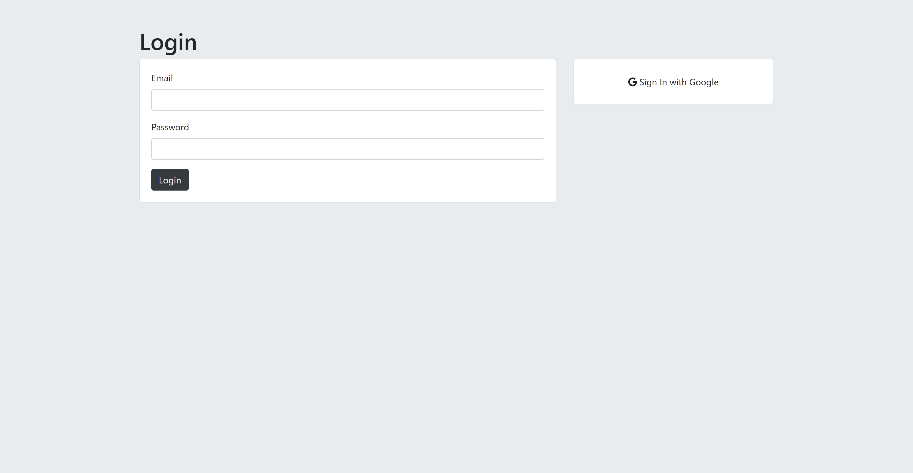
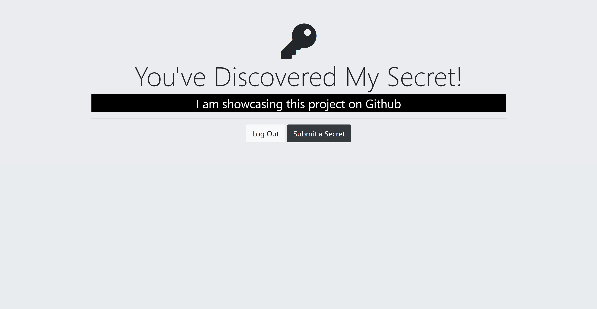

# Secrets App

A web application where users can register, log in, and submit secrets anonymously. The app uses **PostgreSQL**, **bcrypt** for password encryption, **Passport.js** for authentication (local and Google OAuth), and is built using **Express.js**.

## Table of Contents
- [Features](#features)
- [Installation](#installation)
- [Environment Variables](#environment-variables)
- [Usage](#usage)
- [Technologies](#technologies)
- [Screenshots](#screenshots)

## Features
- User authentication (local and Google OAuth)
- Submit secrets anonymously
- Store user secrets securely in a PostgreSQL database
- Use bcrypt to hash passwords
- Responsive frontend with EJS templates

## Installation
1. Clone the repository:
   ```bash
   git clone https://github.com/yourusername/secrets-app.git
   cd secrets-app
2. Install dependencies:
   ```bash
   npm install
3. Set up PostgreSQL and create a database.
4. Create a .env file in the root directory and set the required environment variables (check Environment Variables).
5. Run the application:
   ```bash
   npm start
   
The app should now be running on http://localhost:3000/.

## Environment Variables
Make sure to set up the following environment variables in your .env file:

```plaintext
SESSION_SECRET=your-session-secret
PG_USER=your-pg-username
PG_HOST=localhost
PG_DATABASE=your-database-name
PG_PASSWORD=your-password
PG_PORT=5432
GOOGLE_CLIENT_ID=your-google-client-id
GOOGLE_CLIENT_SECRET=your-google-client-secret
```

## Usage
1. Register using your email or log in using Google OAuth.
2. Submit a secret anonymously after logging in.
3. View your submitted secret on the Secrets page.

## Technologies
- Node.js & Express.js for backend
- PostgreSQL for the database
- Passport.js for authentication (Local and Google OAuth2)
- bcrypt for password encryption
- EJS for templating

## Screenshots

### Login Page


### Secrets Page

